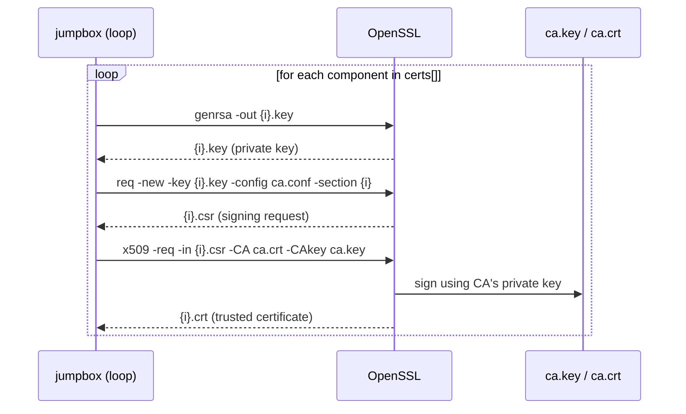
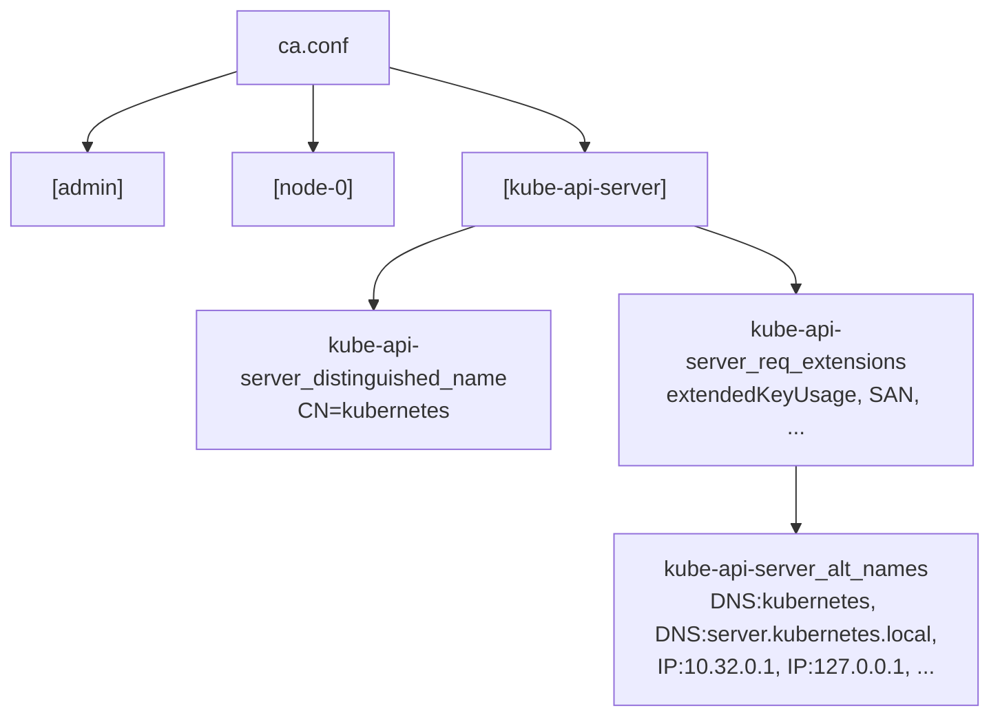
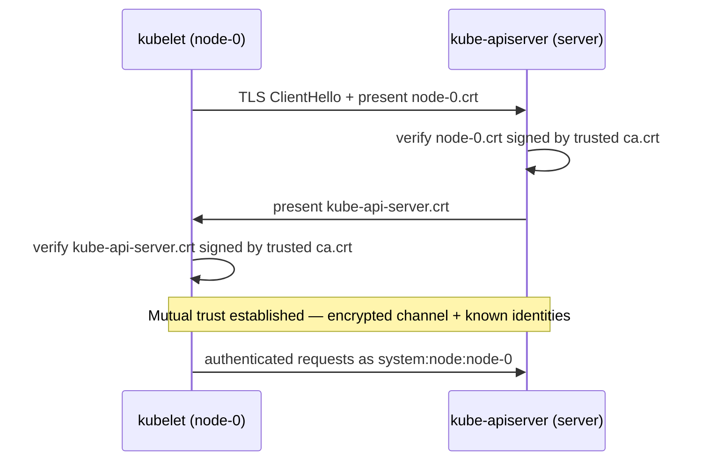

# Kubernetes the Hard Way — Certificates (doc4)

Applies the general concepts from `openssl.md` to the actual CA and certificates
generated in `docs/04-certificate-authority.md`. Read that file first if you're not
already comfortable with `genrsa` / `req` / `x509 -req`, distinguished names, and SANs.

## The CA

```bash
openssl genrsa -out ca.key 4096
openssl req -x509 -new -sha512 -noenc \
  -key ca.key -days 3653 \
  -config ca.conf \
  -out ca.crt
```

This is the one self-signed cert in the whole setup — the root of trust everything
else chains up to. `ca.conf`'s top-level `[req]` / `[req_distinguished_name]` sections
supply its identity (`CN = CA`, org details).

## Why 8 identities for only 3 machines

Your actual cluster is only 3 physical machines (`server`, `node-0`, `node-1`), but
`certs[]` below lists 8 entries. That's because Kubernetes authenticates and
authorizes per **logical identity**, not per machine — several components sharing one
box still each need their own provable identity:

| Identity | Runs on | Why it needs its own identity |
|---|---|---|
| `admin` | you, via `kubectl` (from `server` or jumpbox) | You, the human operator — full cluster-admin RBAC rights |
| `node-0` | `node-0` | That node's `kubelet` — the Node Authorizer checks this specific identity |
| `node-1` | `node-1` | Same, for the other node |
| `kube-proxy` | both `node-0` and `node-1` | The proxy process on every node shares one identity (same binary everywhere, no need to distinguish per node) |
| `kube-scheduler` | `server` | Assigns pods to nodes — separate RBAC scope from... |
| `kube-controller-manager` | `server` | ...running the control loops (replication, etc.) — different RBAC scope again |
| `kube-api-server` | `server` | Different kind of cert: a **server** cert, not a client cert — everyone else verifies *it* using this cert during the handshake |
| `service-accounts` | `server` (used by `kube-controller-manager`) | Not a network identity at all — a signing key pair used to *mint* tokens for pods running inside the cluster |

So `server` alone accounts for 4 of the 8 identities, even though it's one machine —
each process on it is a distinct actor making its own authenticated calls, and
Kubernetes' RBAC model is built around least privilege per identity. If
`kube-scheduler` and `kube-controller-manager` shared a cert, you couldn't grant them
different permissions or revoke one without breaking the other.

## The per-component certs

```bash
certs=(
  "admin" "node-0" "node-1"
  "kube-proxy" "kube-scheduler"
  "kube-controller-manager"
  "kube-api-server"
  "service-accounts"
)

for i in ${certs[*]}; do
  openssl genrsa -out "${i}.key" 4096

  openssl req -new -key "${i}.key" -sha256 \
    -config "ca.conf" -section ${i} \
    -out "${i}.csr"

  openssl x509 -req -days 3653 -in "${i}.csr" \
    -copy_extensions copyall \
    -sha256 -CA "ca.crt" \
    -CAkey "ca.key" \
    -CAcreateserial \
    -out "${i}.crt"
done
```



One identity per Kubernetes component (plus the human `admin` user, plus
`service-accounts`, which is just a signing key pair the controller manager uses
internally — it doesn't identify a network endpoint).

### Why each of the three commands is needed — `genrsa` alone isn't enough

**`openssl genrsa -out "${i}.key" 4096`**
Generates the private key only. Pure math — no identity info needed at all. This step
doesn't touch `ca.conf`.

**`openssl req -new -key "${i}.key" -sha256 -config "ca.conf" -section ${i} -out "${i}.csr"`**
This is where `ca.conf` comes in. A CSR needs to say *who this key belongs to* and
*what the cert should be allowed to do* — and that's exactly the info you don't have
yet after `genrsa` (which only produces raw key material, no identity attached). So:
- `-config "ca.conf"` — points at the file
- `-section ${i}` — for this loop iteration, e.g. `-section node-0`, only read
  `ca.conf`'s `[node-0]` block (which itself points to `[node-0_distinguished_name]`
  for the identity and `[node-0_req_extensions]` for what it's allowed to do)
- Result: `node-0.csr` = "here's `node-0`'s public key (derived from `node-0.key`), and
  here's the identity/capabilities I want baked in — `CN=system:node:node-0`,
  `clientAuth`, etc."

Without `-config`/`-section`, `openssl req` would either prompt you interactively for
every field, or you'd have to pass a long `-subj "/CN=.../O=..."` string plus separate
extension flags by hand — `ca.conf` just pre-stores all of that per identity so the
loop can reuse it.

**`openssl x509 -req -in "${i}.csr" -CA "ca.crt" -CAkey "ca.key" ... -out "${i}.crt"`**
This step doesn't reference `ca.conf` at all — it signs whatever's already inside
`${i}.csr`. `-copy_extensions copyall` just means "carry over the extensions that were
already set in the CSR (from `ca.conf`) into the final cert," rather than dropping
them.

So: `ca.conf` is used in the **middle step** (`req`), to tell OpenSSL who this specific
cert claims to be and what it's authorized to do — `genrsa` doesn't know or care about
identity, and `x509 -req` just signs whatever identity/extensions the CSR already
carries.

`ca.CAcreateserial` is why `ca.srl` shows up after the first cert is signed — OpenSSL
uses it to hand out a unique serial number to each cert it signs.

## What `ca.conf`'s sections actually configure

Each identity gets its own `[section]`, referenced via `-section ${i}`:



Two examples worth reading closely:

**`node-0`** — its distinguished name is:
```ini
CN = system:node:node-0
O  = system:nodes
```
Kubernetes RBAC reads `CN` as the *username* and `O` as the *group*. This is exactly
how `node-0`'s kubelet cert gets recognized as belonging to the `system:nodes` group,
satisfying the [Node Authorizer](https://kubernetes.io/docs/reference/access-authn-authz/node/) —
the cert alone *is* the credential.

**`kube-api-server`** — its SAN list has to cover every name/IP clients might use to
reach it:
```ini
IP.0  = 127.0.0.1
IP.1  = 10.32.0.1
DNS.0 = kubernetes
DNS.1 = kubernetes.default
DNS.2 = kubernetes.default.svc
DNS.3 = kubernetes.default.svc.cluster
DNS.4 = kubernetes.svc.cluster.local
DNS.5 = server.kubernetes.local
DNS.6 = api-server.kubernetes.local
```
`10.32.0.1` is the first IP in the cluster's internal service CIDR — Kubernetes
auto-assigns that address to the `kubernetes` service, so the API server's cert has to
be valid for it too, alongside the in-cluster DNS names and the `server.kubernetes.local`
hostname you SSH to it by.

## Where the certs end up

```bash
# node-0 / node-1
ssh root@${host} mkdir /var/lib/kubelet/
scp ca.crt root@${host}:/var/lib/kubelet/
scp ${host}.crt root@${host}:/var/lib/kubelet/kubelet.crt
scp ${host}.key root@${host}:/var/lib/kubelet/kubelet.key

# server
scp ca.key ca.crt \
  kube-api-server.key kube-api-server.crt \
  service-accounts.key service-accounts.crt \
  root@server:~/
```

- `node-0` / `node-1` get **only their own key/cert + `ca.crt`** — that's all a kubelet
  needs to authenticate itself and verify the API server.
- `server` gets `ca.key`, `ca.crt`, `kube-api-server.{key,crt}`, and
  `service-accounts.{key,crt}` — the API server needs the CA's *private* key too,
  since it validates client certs presented to it, and `service-accounts.key` is what
  the controller manager uses to sign service account tokens.
- **Private keys never leave the jumpbox except to their one owning machine.** Nobody
  else needs them — only the matching `.crt` (public) is meaningful to anyone else.

## Runtime payoff



By the time you reach doc5+ (kubeconfigs) and beyond, every component can prove its
identity to every other component using nothing but "was this signed by our shared
CA?" — no passwords, no shared secrets, just the trust chain built here.
