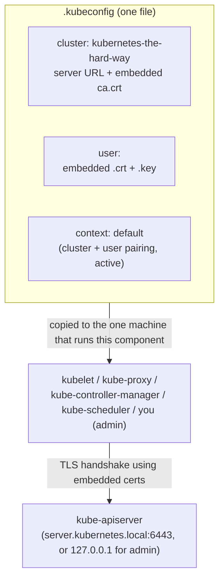

# Kubernetes the Hard Way — Kubeconfigs (doc5)

Builds on `kthw-certificates.md` — this step packages the certs generated there into
`kubeconfig` files, one per component, so each client (kubelet, kube-proxy, the
control-plane services, and you as `admin`) knows how to reach and authenticate to the
API server without passing flags by hand every time.

A kubeconfig is just a YAML file bundling three things: **which cluster** to talk to,
**who you are**, and **which pairing of the two is active**. Every section below
generates the exact same four `kubectl config` subcommands — only the identity
(cert/key) and sometimes the server URL change.

## The kubelet configs (`node-0`, `node-1`)

```bash
for host in node-0 node-1; do
  kubectl config set-cluster kubernetes-the-hard-way \
    --certificate-authority=ca.crt \
    --embed-certs=true \
    --server=https://server.kubernetes.local:6443 \
    --kubeconfig=${host}.kubeconfig

  kubectl config set-credentials system:node:${host} \
    --client-certificate=${host}.crt \
    --client-key=${host}.key \
    --embed-certs=true \
    --kubeconfig=${host}.kubeconfig

  kubectl config set-context default \
    --cluster=kubernetes-the-hard-way \
    --user=system:node:${host} \
    --kubeconfig=${host}.kubeconfig

  kubectl config use-context default \
    --kubeconfig=${host}.kubeconfig
done
```

Produces `node-0.kubeconfig` and `node-1.kubeconfig` — one per worker, since each node
has its own cert/key pair and its own identity.

### Line by line (this pattern repeats for every kubeconfig below)

**`kubectl config set-cluster kubernetes-the-hard-way`**
Defines a *cluster* entry — "here's how to reach the cluster, and how to know I'm
really talking to it":
- `--certificate-authority=ca.crt` — the CA cert this kubeconfig trusts when verifying
  the API server's cert during the TLS handshake.
- `--embed-certs=true` — pastes `ca.crt`'s contents (base64) directly into the
  kubeconfig file instead of storing a path to it. Makes the file self-contained — it
  can be copied to another machine without also shipping `ca.crt` alongside it.
- `--server=https://server.kubernetes.local:6443` — the API server's endpoint. This
  exact hostname has to appear in `kube-api-server.crt`'s SAN list (see
  `kthw-certificates.md`), or cert verification fails.

**`kubectl config set-credentials <name>`**
Defines a *user* entry — "here's who I am and how I prove it":
- `<name>` is just a local label inside this file. For the kubelet it's
  `system:node:${host}`, matching the `CN` baked into `${host}.crt`
  (`CN = system:node:node-0`) — that `CN` is what the API server's Node Authorizer
  actually reads to recognize the identity; the label here is cosmetic, the cert is
  the real credential.
- `--client-certificate` / `--client-key` — the component's own cert + private key,
  used for the proof-of-possession step of the TLS handshake (see `openssl.md`).
- `--embed-certs=true` — same reasoning as above, bakes both files into the kubeconfig.

**`kubectl config set-context default`**
Defines a *context* — a named pairing of "which cluster" + "which user" to use
together, here named `default`.

**`kubectl config use-context default`**
Marks `default` as the active context, so any tool reading this kubeconfig without an
explicit `--context` flag uses this cluster+user pairing automatically.

## The kube-proxy config

```bash
{
  kubectl config set-cluster kubernetes-the-hard-way \
    --certificate-authority=ca.crt \
    --embed-certs=true \
    --server=https://server.kubernetes.local:6443 \
    --kubeconfig=kube-proxy.kubeconfig

  kubectl config set-credentials system:kube-proxy \
    --client-certificate=kube-proxy.crt \
    --client-key=kube-proxy.key \
    --embed-certs=true \
    --kubeconfig=kube-proxy.kubeconfig

  kubectl config set-context default \
    --cluster=kubernetes-the-hard-way \
    --user=system:kube-proxy \
    --kubeconfig=kube-proxy.kubeconfig

  kubectl config use-context default \
    --kubeconfig=kube-proxy.kubeconfig
}
```

Identical structure to the kubelet configs, just one file (`kube-proxy.kubeconfig`)
instead of a per-host loop — every node runs the same `kube-proxy`, using the same
identity (`system:kube-proxy`), so it doesn't need a per-node cert like the kubelet
does.

`{ ... }` here (vs. `for ... do ... done` above) is just a grouped command block —
there's no loop because there's only one `kube-proxy` identity to generate.

## The kube-controller-manager config

```bash
{
  kubectl config set-cluster kubernetes-the-hard-way \
    --certificate-authority=ca.crt \
    --embed-certs=true \
    --server=https://server.kubernetes.local:6443 \
    --kubeconfig=kube-controller-manager.kubeconfig

  kubectl config set-credentials system:kube-controller-manager \
    --client-certificate=kube-controller-manager.crt \
    --client-key=kube-controller-manager.key \
    --embed-certs=true \
    --kubeconfig=kube-controller-manager.kubeconfig

  kubectl config set-context default \
    --cluster=kubernetes-the-hard-way \
    --user=system:kube-controller-manager \
    --kubeconfig=kube-controller-manager.kubeconfig

  kubectl config use-context default \
    --kubeconfig=kube-controller-manager.kubeconfig
}
```

Same pattern again. This is a control-plane component, not a worker component — it
runs on `server`, not `node-0`/`node-1` — but it still talks to the API server over
the network like any other client, so it needs its own kubeconfig just the same.

## The kube-scheduler config

```bash
{
  kubectl config set-cluster kubernetes-the-hard-way \
    --certificate-authority=ca.crt \
    --embed-certs=true \
    --server=https://server.kubernetes.local:6443 \
    --kubeconfig=kube-scheduler.kubeconfig

  kubectl config set-credentials system:kube-scheduler \
    --client-certificate=kube-scheduler.crt \
    --client-key=kube-scheduler.key \
    --embed-certs=true \
    --kubeconfig=kube-scheduler.kubeconfig

  kubectl config set-context default \
    --cluster=kubernetes-the-hard-way \
    --user=system:kube-scheduler \
    --kubeconfig=kube-scheduler.kubeconfig

  kubectl config use-context default \
    --kubeconfig=kube-scheduler.kubeconfig
}
```

Same pattern, third control-plane identity.

## The admin config — the one with a difference

```bash
{
  kubectl config set-cluster kubernetes-the-hard-way \
    --certificate-authority=ca.crt \
    --embed-certs=true \
    --server=https://127.0.0.1:6443 \
    --kubeconfig=admin.kubeconfig

  kubectl config set-credentials admin \
    --client-certificate=admin.crt \
    --client-key=admin.key \
    --embed-certs=true \
    --kubeconfig=admin.kubeconfig

  kubectl config set-context default \
    --cluster=kubernetes-the-hard-way \
    --user=admin \
    --kubeconfig=admin.kubeconfig

  kubectl config use-context default \
    --kubeconfig=admin.kubeconfig
}
```

Notice the server URL: `https://127.0.0.1:6443`, not `server.kubernetes.local`. That's
because `admin.kubeconfig` is meant to be used **from the `server` machine itself**
(you `scp` it there and run `kubectl` locally on the control plane, per the
distribution step below) — so it talks to the API server over loopback. It still works
because `127.0.0.1` is also in `kube-api-server.crt`'s SAN list (see
`kthw-certificates.md`). The identity here, `admin`, maps to full cluster-admin
privileges via RBAC — this is *you*, the human operator, not a Kubernetes system
component.

## Distribute the kubeconfig files

```bash
# kubelet + kube-proxy → worker nodes
for host in node-0 node-1; do
  ssh root@${host} "mkdir -p /var/lib/{kube-proxy,kubelet}"

  scp kube-proxy.kubeconfig \
    root@${host}:/var/lib/kube-proxy/kubeconfig

  scp ${host}.kubeconfig \
    root@${host}:/var/lib/kubelet/kubeconfig
done

# admin + kube-controller-manager + kube-scheduler → control plane
scp admin.kubeconfig \
  kube-controller-manager.kubeconfig \
  kube-scheduler.kubeconfig \
  root@server:~/
```

Each kubeconfig only goes to the machine that actually runs that component:
- `node-0.kubeconfig` / `node-1.kubeconfig` → that node's own `/var/lib/kubelet/kubeconfig`
  (renamed generically — the kubelet binary always looks for the same path/filename
  regardless of which node it's on).
- `kube-proxy.kubeconfig` → both nodes, same file, since `kube-proxy` shares one
  identity everywhere → `/var/lib/kube-proxy/kubeconfig`.
- `admin.kubeconfig`, `kube-controller-manager.kubeconfig`, `kube-scheduler.kubeconfig`
  → `server`, since that's where the control-plane binaries and your admin session
  run.

## Why bundle it all into one file per identity



Without this step, every component would need `ca.crt`, its own cert+key, and the
server URL passed in separately every time it talks to the API server. A kubeconfig
collapses trust anchor + identity + endpoint into one portable file, generated once on
the jumpbox and copied to exactly the machine that needs it.
