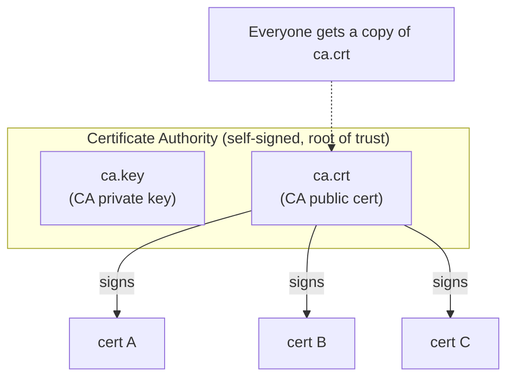
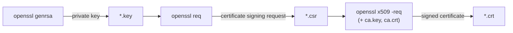
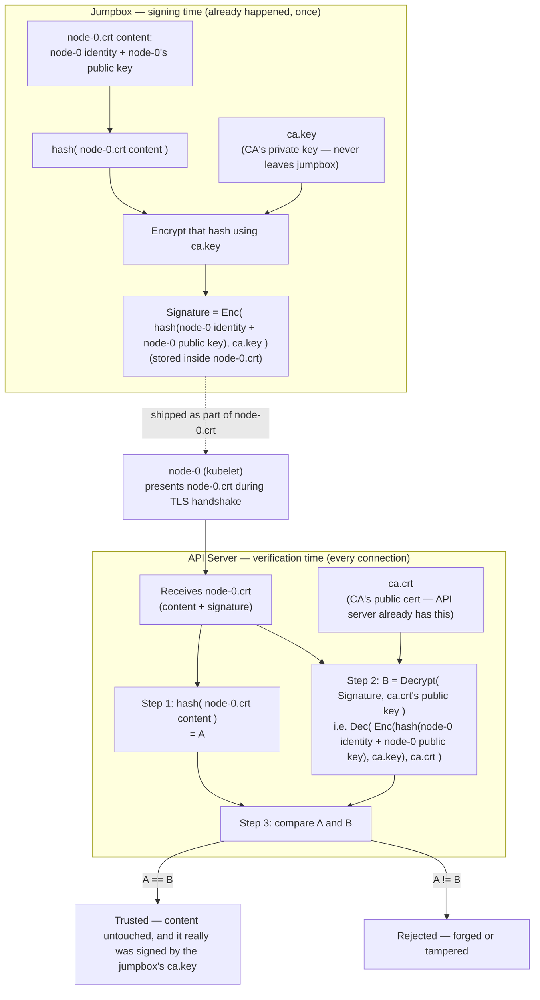
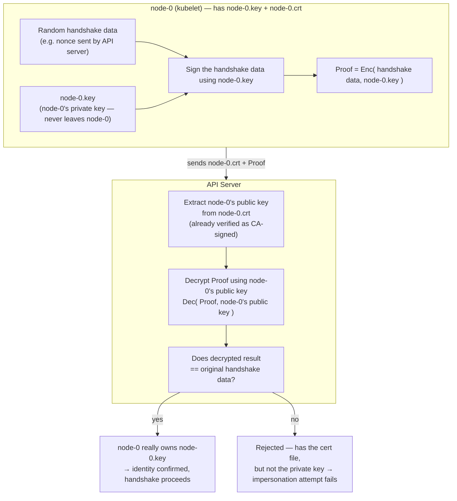

# OpenSSL

`OpenSSL` is a cryptography toolkit — both a library other software links against, and
a command-line tool (`openssl`) you can drive directly. It's the de-facto standard tool
for working with TLS/SSL: generating keys, creating your own Certificate Authority
(CA), and issuing certificates.

## Why certificates at all?

TLS gives you two things at once:

1. **Encryption** — traffic between two ends can't be read by a middleman.
2. **Identity** — the client can prove *who it is* (client cert) and the server can
   prove *it's really the server* (server cert), instead of trusting whoever happens
   to answer on that IP/port.

Identity only works if both sides trust the same authority to vouch for the cert —
that's what a CA is for.

## Asymmetric keys, in one paragraph

Every cert is backed by a **key pair**: a private key (`*.key`, never shared) and a
public key (embedded inside the `*.crt`, shared freely). Anything encrypted/signed
with the private key can be verified with the public key, and vice versa. A
certificate is essentially: *"here is a public key, plus a signature from someone (the
CA) vouching that this key belongs to this identity."*

## Chain of trust



Every certificate above is signed by the **same** CA. That's why every holder of a
signed cert can trust every other holder: they don't need to trust each other
directly — they each just need one copy of `ca.crt`, and check "was this presented
cert signed by the CA I trust?" This is why a private CA is so useful for internal
systems (a cluster, a fleet of internal services, etc): you don't need a public CA
(like Let's Encrypt) at all, since nothing here is public-facing.

## The three commands, and what each one produces

Almost every OpenSSL CA workflow boils down to the same three subcommands, always run
in the same order:



| Command | What it does | Output |
|---|---|---|
| `openssl genrsa -out X.key 4096` | Generates a new 4096-bit RSA **private key**. Nothing sent anywhere, nothing signed yet. | `X.key` |
| `openssl req -new -key X.key ... -out X.csr` | Builds a **Certificate Signing Request**: "here's my public key + who I claim to be (CN, O, SANs, etc) — please sign this." | `X.csr` |
| `openssl x509 -req -in X.csr -CA ca.crt -CAkey ca.key ... -out X.crt` | The CA reviews the CSR and **signs** it, producing the final trusted certificate. | `X.crt` |

The **CA's own** cert/key pair is the one exception — it skips the CSR step, because
nobody signs the CA but itself:

```bash
openssl genrsa -out ca.key 4096
openssl req -x509 -new -sha512 -noenc -key ca.key -days 3653 -out ca.crt
```

`-x509` here means "skip the CSR round-trip, output a self-signed certificate
directly." This is the root of the whole trust chain — its signature is trusted simply
because we said so (`-noenc` also means "don't encrypt the private key with a
passphrase" — fine for a lab, not for production).

## What actually goes inside a certificate

When you build a CSR/cert, you're describing an identity and what it's allowed to do:

- **Distinguished Name (`CN`, `O`, `C`, `ST`, `L`, ...)** — who this identity claims to
  be. `CN` (Common Name) is usually the primary name; `O` (Organization) is often used
  to represent group membership.
- **`basicConstraints`** — is this cert allowed to sign *other* certs? (`CA:TRUE` only
  for the CA itself; every issued cert should be `CA:FALSE`.)
- **`extendedKeyUsage`** — is this cert valid for acting as a TLS client
  (`clientAuth`), a TLS server (`serverAuth`), or both?
- **`subjectAltName` (SAN)** — the actual DNS names / IP addresses this cert is valid
  for. Modern TLS clients check the SAN, not just the CN — a cert with the "right"
  `CN` but a mismatched SAN will still be rejected by a properly-configured client.

You can set all of this either via CLI flags, or (much more manageable once you have
more than one identity to issue certs for) via an OpenSSL **config file**
(`-config some.conf -section name`), which lets you predefine reusable sections
instead of retyping long flag lists per certificate.

## Useful everyday commands

```bash
# Inspect a certificate's contents (CN, SAN, validity dates, issuer, ...)
openssl x509 -in some.crt -noout -text

# Verify a cert was actually signed by a given CA
openssl verify -CAfile ca.crt some.crt

# Check a cert and key actually belong together (their moduli should match)
openssl x509 -noout -modulus -in some.crt | openssl md5
openssl rsa -noout -modulus -in some.key | openssl md5
```

## Where to go next

See `kthw-certificates.md` for a worked example of all of this — the actual private
CA and per-component certificates generated in this tutorial's
`docs/04-certificate-authority.md`.

# PERSONAL NOTESS
Generates a RSA private key
```
1. genrsa → private key
2. req → create a CSR (or self-signed cert) using that key
3. x509 → sign the CSR (often with a CA key/cert) to produce the final certificate
```
- What is a CSR?
  - Certificate Signing Request
    - A file containing public key + identity info (sent to a CA to be signed into a cert)
    - Each component / resource gets its own key + CSR + cert
  
- What is a CRT
  - Just a extension to say mean sth like Certificate

- What makes a CA (Cert Authorizator)
  1. CA private key (`ca-key.pem`) - generated with genrsa
  2. CA Cert (`ca.pem`) - self signed cert made with that 

- `ca.pem` is signed by `ca-key.pem`

- Detail on `req`
  - Generate CSR from existing private key `openssl req -new -key key.pem -out csr.pem -subj "/CN=admin" → generates a CSR from an existing private key.`


- Details on `x509`
  - takes someone's CSR and signs it with CA, producing final cert for a `specific resource`

```
Clarify the setup — the jumpbox is just your workstation for generating/signing certs, not the thing serving TLS.

- Jumpbox: generates the CA key/cert, and generates + signs each component's key/cert (etcd, kube-apiserver, kubelets, etc). It's basically your CA office.
- After signing, you copy (scp) each component's own private key + cert onto that actual server (e.g. kube-apiserver-key.pem + kube-apiserver.pem go onto the control plane node, kubelet-key.pem onto each worker).
- So the k8s cluster nodes do have their own private keys — just not the CA's private key. Each node has the key that matches its own cert, generated on the jumpbox but delivered to it.

The jumpbox keeps the CA key (ca-key.pem) so it can keep signing new certs later, but the CA key isn't deployed to cluster nodes — they only get ca.pem (public, to verify others) plus their own personal key+cert pair.
```
- 


```
On the jumpbox, from docs/04-certificate-authority.md:

CA:
- ca.key (CA private key)
- ca.crt (CA self-signed cert)

For each of the 8 components (admin, node-0, node-1, kube-proxy, kube-scheduler, kube-controller-manager, kube-api-server, service-accounts) — 3 files each:
- <name>.key — private key
- <name>.csr — CSR
- <name>.crt — signed cert

So in total: 2 + (8 × 3) = 26 files sitting on the jumpbox when this step is done.
```

```
Take a concrete example from your project: kube-apiserver → kubelet (e.g. when you run kubectl logs).

1. API server opens a TLS connection to node-0's kubelet.
2. Kubelet presents its cert (kubelet.crt, i.e. node-0.crt). API server checks: is this signed by a CA I trust (ca.crt)? ✅
3. Since it's mutual TLS, API server also presents its own cert (kube-api-server.crt). Kubelet checks it against ca.crt too. ✅
4. Both sides prove they hold the private key matching their cert (the actual TLS handshake crypto step) — this is what makes it "not just showing an ID card," but proving you actually own it.
5. Once both are verified, an encrypted TLS channel is established, and the API server's request goes through, tagged with the identity from its cert (used for RBAC — "is kube-api-server allowed to do this?").

So: cert = identity claim, CA = trust anchor, private key = proof you own the identity. Every service-to-service call in your cluster follows this same pattern.
```
- for 2, `node-0.cert` is signed by CA's private key
  - Contains kubelet's identity + public key + signature (created by hasing cert's content and encrypting that hash with CA's private key)
  - node 0's cert is used for
    - Generating the CSR (prove kubelet owns the public key inside it)
    - Later, during TLS handshake, prove possession of that key
  - How does API server check the `node-0.crt` is signed by CA it trust
    - `node-0.crt` contains
      - kubelet's identity + public key + signature (created by hashing cert's content and encrypting that hash with CA's private key)
    - API takes node-0.crt and do hash(node-0.cert)  A
    - Use CA's public key to decrypt the signature back into hash   B
    - Compare A and B



Key idea: **the jumpbox** is the only machine that ever touches `ca.key`. It uses `ca.key` once, at signing time, to encrypt a hash of node-0's cert content — that encrypted hash is the signature baked into `node-0.crt`. Later, **the API server**, which only ever holds `ca.crt` (the public half), re-hashes the cert content itself and decrypts the signature using `ca.crt`. If its own hash matches the decrypted one, that proves two things: the cert wasn't altered since the jumpbox signed it, and whoever signed it really did hold `ca.key`.

## Proof of possession — why stealing node-0.crt alone isn't enough

The cert-signature check above only proves the CA vouched for *that identity + public key pairing*. It says nothing about whether whoever is presenting `node-0.crt` right now actually owns the matching private key (`node-0.key`). That's a separate check, done live during the same TLS handshake:



This is the piece an attacker can't fake with a stolen `node-0.crt` alone: they can present the cert, but without `node-0.key` they can't produce a valid `Proof` for whatever handshake data the API server sends, since that step requires the private key itself, not just the public cert.