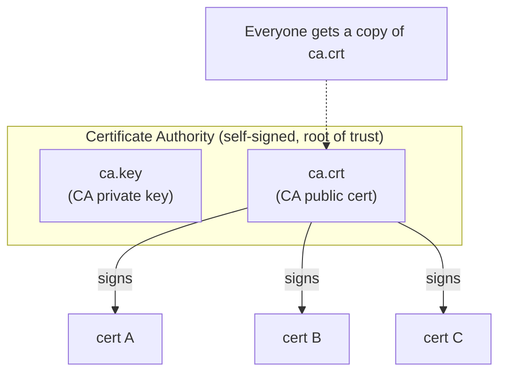
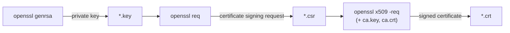

# OpenSSL

`OpenSSL` is a cryptography toolkit — both a library other software links against, and
a command-line tool (`openssl`) you can drive directly. It's the de-facto standard tool
for working with TLS/SSL: generating keys, creating your own Certificate Authority
(CA), and issuing certificates.

## Why certificates at all?

TLS gives you two things at once:

1. **Encryption** — traffic between two ends can't be read by a middleman.
2. **Identity** — the client can prove *who it is* (client cert) and the server can
   prove *it's really the server* (server cert), instead of trusting whoever happens
   to answer on that IP/port.

Identity only works if both sides trust the same authority to vouch for the cert —
that's what a CA is for.

## Asymmetric keys, in one paragraph

Every cert is backed by a **key pair**: a private key (`*.key`, never shared) and a
public key (embedded inside the `*.crt`, shared freely). Anything encrypted/signed
with the private key can be verified with the public key, and vice versa. A
certificate is essentially: *"here is a public key, plus a signature from someone (the
CA) vouching that this key belongs to this identity."*

## Chain of trust



Every certificate above is signed by the **same** CA. That's why every holder of a
signed cert can trust every other holder: they don't need to trust each other
directly — they each just need one copy of `ca.crt`, and check "was this presented
cert signed by the CA I trust?" This is why a private CA is so useful for internal
systems (a cluster, a fleet of internal services, etc): you don't need a public CA
(like Let's Encrypt) at all, since nothing here is public-facing.

## The three commands, and what each one produces

Almost every OpenSSL CA workflow boils down to the same three subcommands, always run
in the same order:



| Command | What it does | Output |
|---|---|---|
| `openssl genrsa -out X.key 4096` | Generates a new 4096-bit RSA **private key**. Nothing sent anywhere, nothing signed yet. | `X.key` |
| `openssl req -new -key X.key ... -out X.csr` | Builds a **Certificate Signing Request**: "here's my public key + who I claim to be (CN, O, SANs, etc) — please sign this." | `X.csr` |
| `openssl x509 -req -in X.csr -CA ca.crt -CAkey ca.key ... -out X.crt` | The CA reviews the CSR and **signs** it, producing the final trusted certificate. | `X.crt` |

The **CA's own** cert/key pair is the one exception — it skips the CSR step, because
nobody signs the CA but itself:

```bash
openssl genrsa -out ca.key 4096
openssl req -x509 -new -sha512 -noenc -key ca.key -days 3653 -out ca.crt
```

`-x509` here means "skip the CSR round-trip, output a self-signed certificate
directly." This is the root of the whole trust chain — its signature is trusted simply
because we said so (`-noenc` also means "don't encrypt the private key with a
passphrase" — fine for a lab, not for production).

## What actually goes inside a certificate

When you build a CSR/cert, you're describing an identity and what it's allowed to do:

- **Distinguished Name (`CN`, `O`, `C`, `ST`, `L`, ...)** — who this identity claims to
  be. `CN` (Common Name) is usually the primary name; `O` (Organization) is often used
  to represent group membership.
- **`basicConstraints`** — is this cert allowed to sign *other* certs? (`CA:TRUE` only
  for the CA itself; every issued cert should be `CA:FALSE`.)
- **`extendedKeyUsage`** — is this cert valid for acting as a TLS client
  (`clientAuth`), a TLS server (`serverAuth`), or both?
- **`subjectAltName` (SAN)** — the actual DNS names / IP addresses this cert is valid
  for. Modern TLS clients check the SAN, not just the CN — a cert with the "right"
  `CN` but a mismatched SAN will still be rejected by a properly-configured client.

You can set all of this either via CLI flags, or (much more manageable once you have
more than one identity to issue certs for) via an OpenSSL **config file**
(`-config some.conf -section name`), which lets you predefine reusable sections
instead of retyping long flag lists per certificate.

## Useful everyday commands

```bash
# Inspect a certificate's contents (CN, SAN, validity dates, issuer, ...)
openssl x509 -in some.crt -noout -text

# Verify a cert was actually signed by a given CA
openssl verify -CAfile ca.crt some.crt

# Check a cert and key actually belong together (their moduli should match)
openssl x509 -noout -modulus -in some.crt | openssl md5
openssl rsa -noout -modulus -in some.key | openssl md5
```

## Where to go next

See `kthw-certificates.md` for a worked example of all of this — the actual private
CA and per-component certificates generated in this tutorial's
`docs/04-certificate-authority.md`.
